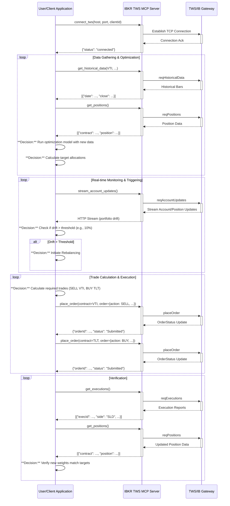

# IBKR TWS API MCP Server Design Document

This document details the design of a Python-based Model Context Protocol (MCP) server for the IBKR TWS API. The server uses the official MCP Python SDK (`modelcontextprotocol/python-sdk`) to expose key TWS API functionalities as MCP tools, with HTTP streaming support via the Streamable HTTP transport. The design uses `uv` for Python environment management and prefixes all API endpoints with `/api/v1`.

## 1. Architecture Overview

The MCP server will be built using the **FastMCP** framework from the official MCP Python SDK. This framework provides a high-level, decorator-based API for defining MCP tools, resources, and prompts. The server will leverage `ib_async` (maintained fork of ib-insync) as the primary library for interacting with the IBKR TWS API, due to its asynchronous nature and simplified event handling.

### Key Components:

*   **FastMCP Server:** The core MCP server instance that handles protocol compliance, message routing, and lifecycle management. It will expose TWS API functionalities as MCP **tools**.
*   **`ib_async` TWS Client:** An asynchronous client instance responsible for connecting to the local TWS or IB Gateway, making TWS API calls, and handling TWS API callbacks. This client will be initialized during the server's lifespan and managed via a context manager.
*   **Streamable HTTP Transport:** The MCP SDK's built-in HTTP transport is used to expose the server over HTTP, supporting stateful sessions with streaming data via HTTP chunked transfer encoding.
*   **Starlette ASGI Application:** The FastMCP server is mounted on a Starlette ASGI application to provide the `/api/v1` prefix and enable CORS configuration for browser-based clients.
*   **Configuration Management:** Environment variables (managed via `.env` files and `uv`) configure TWS connection details (host, port, client ID) and server settings.

### Architecture Diagram:

```
┌─────────────────────────────────────────────────────────────┐
│                    MCP Client (LLM App)                     │
└──────────────────────────┬──────────────────────────────────┘
                           │ HTTP Streaming (MCP Protocol)
                           │
                           ▼
┌─────────────────────────────────────────────────────────────┐
│              Starlette ASGI App (/api/v1)                   │
│  ┌───────────────────────────────────────────────────────┐  │
│  │            FastMCP Server (MCP Tools)                 │  │
│  │  ┌─────────────────────────────────────────────────┐  │  │
│  │  │       ib_insync TWS Client (Lifespan)           │  │  │
│  │  │  ┌───────────────────────────────────────────┐  │  │  │
│  │  │  │     TWS/IB Gateway (TCP Socket)           │  │  │  │
│  │  │  └───────────────────────────────────────────┘  │  │  │
│  │  └─────────────────────────────────────────────────┘  │  │
│  └───────────────────────────────────────────────────────┘  │
└─────────────────────────────────────────────────────────────┘
```

## 2. MCP Tools Design


The MCP server will expose TWS API functionalities as **MCP tools**. Each tool will correspond to a specific TWS API operation, identified in the e2e case analysis. Tools will be defined using the `@mcp.tool()` decorator from the FastMCP framework.

### Tool Naming Convention:

All tools will be prefixed with `ibkr_` to clearly identify them as IBKR TWS API operations. For example:
*   `ibkr_connect`
*   `ibkr_get_contract_details`
*   `ibkr_place_order`

### Tool Categories:

Tools will be organized into the following categories based on functionality:

1.  **Connection Management Tools:** `ibkr_connect`, `ibkr_disconnect`, `ibkr_get_status`
2.  **Contract and Market Data Tools:** `ibkr_search_symbols`, `ibkr_get_contract_details`, `ibkr_get_historical_data`, `ibkr_stream_market_data`
3.  **Account and Portfolio Tools:** `ibkr_get_account_summary`, `ibkr_get_positions`, `ibkr_stream_account_updates`, `ibkr_get_pnl`, `ibkr_get_pnl_single`
4.  **Order Management Tools:** `ibkr_place_order`, `ibkr_cancel_order`, `ibkr_get_open_orders`, `ibkr_get_executions`
5.  **News Tools:** `ibkr_get_news_providers`, `ibkr_get_historical_news`, `ibkr_get_news_article`, `ibkr_stream_news_bulletins`

### Tool Definitions (Examples):

Below are examples of how key tools will be defined using the FastMCP framework:

```python
from mcp.server.fastmcp import FastMCP, Context
from mcp.server.session import ServerSession
from ib_insync import IB, Stock, MarketOrder
from typing import Dict, Any, List

mcp = FastMCP("IBKR TWS MCP Server")

@mcp.tool()
async def ibkr_connect(
    host: str = "127.0.0.1",
    port: int = 7496,
    clientId: int = 1,
    ctx: Context[ServerSession, Any] = None
) -> Dict[str, str]:
    """
    Connect to IBKR TWS or IB Gateway.
    
    Args:
        host: TWS/IB Gateway host address
        port: TWS/IB Gateway port (7496 for TWS, 4001 for IB Gateway paper, 4002 for live)
        clientId: Unique client ID for this connection
        ctx: MCP context (auto-injected)
    
    Returns:
        Connection status
    """
    ib = ctx.request_context.lifespan_context.ib
    if ib.isConnected():
        return {"status": "already_connected"}
    
    await ib.connectAsync(host=host, port=port, clientId=clientId)
    await ctx.info(f"Connected to TWS at {host}:{port}")
    return {"status": "connected", "host": host, "port": port}

@mcp.tool()
async def ibkr_get_contract_details(
    symbol: str,
    secType: str = "STK",
    exchange: str = "SMART",
    currency: str = "USD",
    ctx: Context[ServerSession, Any] = None
) -> List[Dict[str, Any]]:
    """
    Get contract details for a given symbol.
    
    Args:
        symbol: Ticker symbol (e.g., "AAPL", "VTI")
        secType: Security type (STK, OPT, FUT, etc.)
        exchange: Exchange (SMART for smart routing)
        currency: Currency (USD, EUR, etc.)
        ctx: MCP context (auto-injected)
    
    Returns:
        List of contract details
    """
    ib = ctx.request_context.lifespan_context.ib
    contract = Stock(symbol=symbol, exchange=exchange, currency=currency)
    details = await ib.reqContractDetailsAsync(contract)
    
    if not details:
        raise ValueError(f"Contract not found: {symbol}")
    
    return [
        {
            "symbol": cd.contract.symbol,
            "conId": cd.contract.conId,
            "longName": cd.longName,
            "industry": cd.industry,
            "category": cd.category,
        }
        for cd in details
    ]

@mcp.tool()
async def ibkr_place_order(
    symbol: str,
    action: str,
    quantity: int,
    orderType: str = "MKT",
    limitPrice: float = None,
    exchange: str = "SMART",
    currency: str = "USD",
    ctx: Context[ServerSession, Any] = None
) -> Dict[str, Any]:
    """
    Place an order for a stock.
    
    Args:
        symbol: Ticker symbol
        action: BUY or SELL
        quantity: Number of shares
        orderType: Order type (MKT, LMT, etc.)
        limitPrice: Limit price (required for LMT orders)
        exchange: Exchange
        currency: Currency
        ctx: MCP context (auto-injected)
    
    Returns:
        Order details including order ID and status
    """
    ib = ctx.request_context.lifespan_context.ib
    contract = Stock(symbol=symbol, exchange=exchange, currency=currency)
    
    # Qualify the contract
    qualified = await ib.qualifyContractsAsync(contract)
    if not qualified:
        raise ValueError(f"Contract not found: {symbol}")
    contract = qualified[0]
    
    # Create order
    if orderType == "MKT":
        order = MarketOrder(action, quantity)
    elif orderType == "LMT":
        if limitPrice is None:
            raise ValueError("limitPrice is required for LMT orders")
        order = LimitOrder(action, quantity, limitPrice)
    else:
        raise ValueError(f"Unsupported order type: {orderType}")
    
    # Place order
    trade = ib.placeOrder(contract, order)
    await asyncio.sleep(1)  # Allow order to be submitted
    
    await ctx.info(f"Order placed: {action} {quantity} {symbol} @ {orderType}")
    
    return {
        "orderId": trade.order.orderId,
        "status": trade.orderStatus.status,
        "symbol": symbol,
        "action": action,
        "quantity": quantity,
    }
```

### Streaming Tools:

For streaming data (market data, account updates), MCP tools will return structured data at intervals. The MCP protocol supports long-running tools that can send progress updates and notifications via the `Context` object.

Example streaming tool:

```python
@mcp.tool()
async def ibkr_stream_market_data(
    symbol: str,
    duration_seconds: int = 60,
    ctx: Context[ServerSession, Any] = None
) -> Dict[str, Any]:
    """
    Stream real-time market data for a symbol.
    
    Args:
        symbol: Ticker symbol
        duration_seconds: How long to stream (in seconds)
        ctx: MCP context (auto-injected)
    
    Returns:
        Summary of streamed data
    """
    ib = ctx.request_context.lifespan_context.ib
    contract = Stock(symbol=symbol, exchange="SMART", currency="USD")
    
    qualified = await ib.qualifyContractsAsync(contract)
    if not qualified:
        raise ValueError(f"Contract not found: {symbol}")
    contract = qualified[0]
    
    ticker = ib.reqMktData(contract, "", False, False)
    await ctx.info(f"Streaming market data for {symbol}")
    
    start_time = asyncio.get_event_loop().time()
    updates = []
    
    while (asyncio.get_event_loop().time() - start_time) < duration_seconds:
        await asyncio.sleep(2)
        data = {
            "time": datetime.now().isoformat(),
            "lastPrice": ticker.last,
            "bid": ticker.bid,
            "ask": ticker.ask,
            "volume": ticker.volume,
        }
        updates.append(data)
        await ctx.info(f"Market update: {symbol} @ {ticker.last}")
    
    ib.cancelMktData(contract)
    await ctx.info(f"Streaming completed for {symbol}")
    
    return {
        "symbol": symbol,
        "updates_count": len(updates),
        "latest": updates[-1] if updates else None,
    }
```

## 3. Lifespan Management and IB Client Initialization

The `ib_insync` client will be initialized during the server's lifespan using an async context manager. This ensures that the TWS connection is established at startup and properly closed at shutdown.

```python
from contextlib import asynccontextmanager
from dataclasses import dataclass
from ib_insync import IB

@dataclass
class AppContext:
    """Application context with IB client."""
    ib: IB

@asynccontextmanager
async def app_lifespan(server: FastMCP):
    """Manage IB client lifecycle."""
    ib = IB()
    # Note: Connection is established via the ibkr_connect tool, not here
    # This allows for dynamic connection configuration
    try:
        yield AppContext(ib=ib)
    finally:
        if ib.isConnected():
            ib.disconnect()

mcp = FastMCP("IBKR TWS MCP Server", lifespan=app_lifespan)
```

## 4. HTTP Transport and API Prefix

The FastMCP server will be mounted on a Starlette ASGI application to provide the `/api/v1` prefix and enable CORS configuration.

```python
from starlette.applications import Starlette
from starlette.routing import Mount
from starlette.middleware.cors import CORSMiddleware

# Create the Starlette app with /api/v1 prefix
app = Starlette(
    routes=[
        Mount("/api/v1", app=mcp.streamable_http_app()),
    ]
)

# Add CORS middleware
app = CORSMiddleware(
    app,
    allow_origins=["*"],
    allow_methods=["GET", "POST", "DELETE", "OPTIONS"],
    allow_headers=["*"],
    expose_headers=["Mcp-Session-Id"],
)
```

The server will be run using `uvicorn`:

```python
if __name__ == "__main__":
    import uvicorn
    port = int(os.getenv("PORT", 8000))
    uvicorn.run(app, host="0.0.0.0", port=port)
```

## 5. Traceability Matrix (Updated)

This matrix maps the e2e case steps and required TWS API functionalities to the proposed MCP server tools.

| E2E Case Step                      | Required TWS API Functionality          | MCP Server Tool(s)                                           | Notes                                                                                                                                                                    |
| :--------------------------------- | :-------------------------------------- | :----------------------------------------------------------- | :----------------------------------------------------------------------------------------------------------------------------------------------------------------------- |
| 1. Redefine Target Allocations    | `reqHistoricalData`                     | `ibkr_get_historical_data`                                   | Fetches past data for optimization algorithms.                                                                                                                           |
|                                    | `reqMktData`                            | `ibkr_stream_market_data`                                    | Streams real-time data for dynamic updates.                                                                                                                              |
|                                    | `reqContractDetails`                    | `ibkr_get_contract_details`                                  | Ensures correct contract identification.                                                                                                                                 |
|                                    | `reqMatchingSymbols`                    | `ibkr_search_symbols`                                        | Search for contracts by partial symbol (e.g., find ETFs).                                                                                                                |
|                                    | `reqHistoricalNews`                     | `ibkr_get_historical_news`                                   | Retrieve news for fundamental analysis and sentiment.                                                                                                                    |
| 2. Set Rebalancing Triggers        | `reqAccountUpdates`                     | `ibkr_stream_account_updates`                                | Monitors portfolio weights in real-time.                                                                                                                                 |
|                                    | `reqPositions`                          | `ibkr_get_positions`                                         | Initial snapshot of holdings.                                                                                                                                            |
|                                    | `reqMktData`                            | `ibkr_stream_market_data`                                    | For real-time valuation of positions.                                                                                                                                    |
|                                    | `reqNewsBulletins`                      | `ibkr_stream_news_bulletins`                                 | Monitor IB system alerts that may affect trading.                                                                                                                        |
| 3. Gather Current Portfolio Data   | `reqAccountSummary`                     | `ibkr_get_account_summary`                                   | Provides overall account metrics.                                                                                                                                        |
|                                    | `reqPositions`                          | `ibkr_get_positions`                                         | Detailed position information.                                                                                                                                           |
|                                    | `reqContractDetails`                    | `ibkr_get_contract_details`                                  | For accurate contract details within positions.                                                                                                                          |
|                                    | `reqNewsProviders`                      | `ibkr_get_news_providers`                                    | Get available news sources for research.                                                                                                                                 |
| 4. Calculate Trades Required       | (Client-side logic)                     | (Handled by client logic using data from other tools)        | MCP tools provide data; calculation logic resides in the client application.                                                                                             |
|                                    | `reqContractDetails`                    | `ibkr_get_contract_details`                                  | Essential for defining contracts for trade calculations.                                                                                                                 |
| 5. Execute Trades                  | `placeOrder`                            | `ibkr_place_order`                                           | Submits market, limit, and advanced order types.                                                                                                                         |
|                                    | `orderStatus` (callback)                | (Handled via `ibkr_get_open_orders` polling or streaming)    | Order status can be checked via open orders or streamed account updates.                                                                                                 |
|                                    | `reqExecutions`                         | `ibkr_get_executions`                                        | Confirms order fills and execution details.                                                                                                                              |
|                                    | `reqContractDetails`                    | `ibkr_get_contract_details`                                  | Ensures correct contract specification for order placement.                                                                                                              |
| 6. Verify and Monitor Post-Rebalance| `reqAccountUpdates`                     | `ibkr_stream_account_updates`                                | Confirms new weights and monitors changes.                                                                                                                               |
|                                    | `reqPositions`                          | `ibkr_get_positions`                                         | Updated snapshot of holdings.                                                                                                                                            |
|                                    | `reqAccountSummary`                     | `ibkr_get_account_summary`                                   | Overall account performance metrics.                                                                                                                                     |
|                                    | `reqPnL`, `reqPnLSingle`                | `ibkr_get_pnl`, `ibkr_get_pnl_single`                        | Tracks profit and loss.                                                                                                                                                  |
|                                    | `reqHistoricalNews`                     | `ibkr_get_historical_news`                                   | Review news around trade execution for post-analysis.                                                                                                                    |
|                                    | `reqNewsArticle`                        | `ibkr_get_news_article`                                      | Get full article text for detailed review.                                                                                                                               |
| 7. Ongoing Maintenance             | (Re-uses previous functionalities)      | (Re-uses previous tools)                                     | This step primarily involves orchestrating the above tools based on scheduled events or triggers.                                                                        |
|                                    | `reqNewsBulletins`                      | `ibkr_stream_news_bulletins`                                 | Monitor ongoing market news and system alerts.                                                                                                                           |

## 6. Environment Management with `uv`

The project will use `uv` for Python environment management, as recommended by the MCP Python SDK documentation.

### Project Initialization:

```bash
uv init ibkr-tws-mcp-server
cd ibkr-tws-mcp-server
```

### Dependencies:

```bash
uv add "mcp[cli]"
uv add ib-ssync
uv add starlette
uv add uvicorn[standard]
uv add python-dotenv
```

### Running the Server:

```bash
uv run python main.py
```

## 7. Docker Support

The server will be containerized using Docker, with `uv` installed in the container for dependency management.

### Dockerfile:

```dockerfile
FROM python:3.11-slim

# Install uv
RUN pip install uv

WORKDIR /app

# Copy project files
COPY pyproject.toml uv.lock ./
COPY main.py ./

# Install dependencies with uv
RUN uv sync --frozen

# Expose the server port
EXPOSE 8000

# Run the server
CMD ["uv", "run", "python", "main.py"]
```

### docker-compose.yml:

```yaml
version: '3.8'

services:
  ibkr-mcp-server:
    build: .
    ports:
      - "8000:8000"
    environment:
      - TWS_HOST=${TWS_HOST:-host.docker.internal}
      - TWS_PORT=${TWS_PORT:-7496}
      - TWS_CLIENT_ID=${TWS_CLIENT_ID:-1}
      - PORT=8000
    extra_hosts:
      - "host.docker.internal:host-gateway"
    restart: unless-stopped
```

## 8. Implementation Considerations

*   **Asynchronous Programming:** Both `ib_insync` and the MCP SDK are asynchronous. All tool functions will be defined as `async def`.
*   **Error Handling:** Tools will raise appropriate exceptions (e.g., `ValueError`, `RuntimeError`) which the MCP framework will convert to MCP error responses.
*   **State Management:** The `ib_insync` client instance will be managed via the lifespan context and accessed within tools via `ctx.request_context.lifespan_context.ib`.
*   **Streaming Data:** Long-running streaming tools will use `ctx.info()` and `ctx.report_progress()` to send updates to the client.
*   **Security:** Credentials and connection details will be managed via environment variables. The MCP server should run in a secure, isolated environment.

This updated design provides a solid foundation for developing the IBKR TWS API MCP server using the official MCP Python SDK, `uv` for environment management, and the `/api/v1` prefix for all endpoints.


# Amend

## 2. API Endpoints and MCP Tools Design

Instead of traditional REST endpoints, the MCP server exposes `tools` and `resources`. These are mounted under the `/api/v1` prefix. The interaction is through the MCP protocol, using HTTP streaming with chunked transfer encoding for real-time data.

### 2.1. Core MCP Tools

The following functions will be defined as `@mcp.tool()`s, corresponding to the TWS API functionalities identified in the e2e case.

*   **`connect_tws(host: str, port: int, clientId: int)`:** Initiates connection to TWS/IB Gateway.
*   **`disconnect_tws()`:** Disconnects from TWS/IB Gateway.
*   **`get_connection_status()`:** Checks connection status.
*   **`get_next_valid_id()`:** Retrieves the next valid order ID.
*   **`get_contract_details(symbol: str, secType: str, exchange: str, currency: str)`:** Requests contract details.
*   **`get_historical_data(...)`:** Requests historical market data.
*   **`stream_market_data(symbol: str, ...)`:** Streams real-time market data. This tool will use `ctx.send_event` to stream data back to the client.
*   **`get_account_summary()`:** Retrieves account summary details.
*   **`get_positions()`:** Retrieves current portfolio positions.
*   **`stream_account_updates()`:** Streams real-time account and portfolio updates. This tool will use `ctx.send_event`.
*   **`get_pnl()`:** Retrieves P&L for all positions.
*   **`get_pnl_single(...)`:** Retrieves P&L for a single position.
*   **`place_order(contract: dict, order: dict)`:** Places a new order.
*   **`cancel_order(orderId: int)`:** Cancels a specific order.
*   **`get_open_orders()`:** Retrieves all currently open orders.
*   **`get_executions()`:** Retrieves execution reports.

## 3. Traceability Matrix

This matrix maps the e2e case steps to the proposed MCP server tools.

| E2E Case Step                      | Required TWS API Functionality          | MCP Server Tool(s)                                       | Notes                                                                                                                                                                    |
| :--------------------------------- | :-------------------------------------- | :------------------------------------------------------- | :----------------------------------------------------------------------------------------------------------------------------------------------------------------------- |
| 1. Redefine Target Allocations    | `reqHistoricalData`                     | `get_historical_data`                                    | Fetches past data for optimization algorithms.                                                                                                                           |
|                                    | `reqMktData`                            | `stream_market_data`                                     | Streams real-time data for dynamic updates.                                                                                                                              |
|                                    | `reqContractDetails`                    | `get_contract_details`                                   | Ensures correct contract identification.                                                                                                                                 |
| 2. Set Rebalancing Triggers        | `reqAccountUpdates`                     | `stream_account_updates`                                 | Monitors portfolio weights in real-time.                                                                                                                                 |
|                                    | `reqPositions`                          | `get_positions`                                          | Initial snapshot of holdings.                                                                                                                                            |
| 3. Gather Current Portfolio Data   | `reqAccountSummary`                     | `get_account_summary`                                    | Provides overall account metrics.                                                                                                                                        |
|                                    | `reqPositions`                          | `get_positions`                                          | Detailed position information.                                                                                                                                           |
| 4. Calculate Trades Required       | (Client-side logic/TWS `transmit=False`)| `place_order` (with `transmit=False`)                    | Simulation can be done by placing orders with `transmit=False`.                                                                                                          |
| 5. Execute Trades                  | `reqIds`                                | `get_next_valid_id`                                      | Obtains a unique order ID before placing an order.                                                                                                                       |
|                                    | `placeOrder`                            | `place_order`                                            | Submits market, limit, and advanced order types.                                                                                                                         |
|                                    | `reqExecutions`                         | `get_executions`                                         | Confirms order fills and execution details.                                                                                                                              |
| 6. Verify and Monitor Post-Rebalance| `reqAccountUpdates`                     | `stream_account_updates`                                 | Confirms new weights and monitors changes.                                                                                                                               |
|                                    | `reqPositions`                          | `get_positions`                                          | Updated snapshot of holdings.                                                                                                                                            |
|                                    | `reqPnL`                                | `get_pnl`                                                | Tracks profit and loss.                                                                                                                                                  |

## 4. References

*   **IBKR TWS API Documentation:** [https://interactivebrokers.github.io/tws-api/](https://interactivebrokers.github.io/tws-api/)
*   **ib_async Documentation:** [https://ib-api-reloaded.github.io/ib_async/](https://ib-api-reloaded.github.io/ib_async/) (API-compatible with ib-insync)
*   **Model Context Protocol (MCP) Documentation:** [https://modelcontextprotocol.io/](https://modelcontextprotocol.io/)
*   **MCP Python SDK GitHub Repository:** [https://github.com/modelcontextprotocol/python-sdk](https://github.com/modelcontextprotocol/python-sdk)

## 5. Portfolio Optimization Workflow Sequence Diagram

This diagram illustrates the portfolio rebalancing workflow from the e2e case, showing interactions between the user/client, the MCP server, and the TWS API.



## 6. Unit Test Structure

Unit tests will be organized using Python's `unittest` framework and will focus on testing individual components in isolation. We will use `unittest.mock` to patch the `ib_insync` client, so we can test the MCP tools without needing a live connection to TWS.

The directory structure will be as follows:

```
/ibkr-tws-mcp-server
|-- src
|   |-- __init__.py
|   |-- server.py  # Main MCP server implementation
|   |-- tws_client.py # Wrapper for ib_insync logic
|-- tests
|   |-- __init__.py
|   |-- test_server.py # Unit tests for MCP tools
|   |-- fixtures # Directory for mock data
|       |-- sample_positions.json
|       |-- sample_historical_data.json
|-- pyproject.toml
|-- uv.lock
```

**`test_server.py` Example Structure:**

```python
import unittest
from unittest.mock import AsyncMock, patch

from src.server import mcp # Assuming mcp is the FastMCP instance

class TestMCPServer(unittest.TestCase):

    @patch('src.tws_client.IB')
    def test_get_positions(self, mock_ib):
        # Arrange: Set up the mock ib_insync client
        mock_instance = mock_ib.return_value
        mock_instance.positions.return_value = [...] # Load from fixtures/sample_positions.json

        # Act: Call the tool function directly
        # Note: We need a way to get the underlying function from the MCP tool
        result = mcp.get_tool('get_positions').fn()

        # Assert: Check if the result is as expected
        self.assertEqual(len(result), 2)
        self.assertEqual(result[0]['contract']['symbol'], 'AAPL')

    # ... more tests for other tools ...

if __name__ == '__main__':
    unittest.main()
```

## 7. SIT (System Integration Testing) Test Cases (cURL)

SIT will be performed by running the MCP server (connected to a paper trading TWS account) and using `curl` to interact with the HTTP endpoints. These tests validate the end-to-end flow from the client request to the TWS API and back.

**Prerequisites:**

*   The MCP server is running and accessible at `http://localhost:8000`.
*   TWS or IB Gateway is running and connected to a paper account.

**Test Case 1: Connect and Get Positions**

```bash
# 1. Connect to TWS
curl -X POST http://localhost:8000/api/v1/connect_tws -H "Content-Type: application/json" -d '{"host": "127.0.0.1", "port": 7496, "clientId": 1}'

# 2. Get current positions
curl http://localhost:8000/api/v1/get_positions
```

**Test Case 2: Get Historical Data for an ETF**

```bash
# Get last 30 days of historical data for VTI
curl -X POST http://localhost:8000/api/v1/get_historical_data -H "Content-Type: application/json" -d '{
  "contract": {"symbol": "VTI", "secType": "STK", "exchange": "SMART", "currency": "USD"},
  "durationStr": "30 D",
  "barSizeSetting": "1 day"
}'
```

**Test Case 3: Stream Real-Time Market Data for an ETF**

```bash
# Stream market data for SPY. The connection will remain open for HTTP streaming.
curl -N http://localhost:8000/api/v1/stream_market_data?symbol=SPY&secType=STK
```

**Test Case 4: Place and Cancel a Market Order**

```bash
# 1. Place a market order to BUY 1 share of AAPL
curl -X POST http://localhost:8000/api/v1/place_order -H "Content-Type: application/json" -d '{
  "contract": {"symbol": "AAPL", "secType": "STK", "exchange": "SMART", "currency": "USD"},
  "order": {"action": "BUY", "totalQuantity": 1, "orderType": "MKT"}
}'

# Assume the response gives orderId 12345

# 2. Cancel the order
curl -X DELETE http://localhost:8000/api/v1/cancel_order/12345
```
